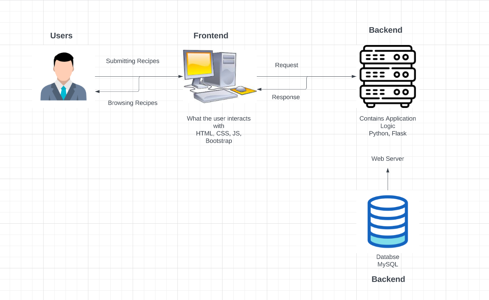

### 1- Project title
# Grandma’s Recipe Book

### 2- Introduction
This app is a collection of recipes submitted by users for other application visitors to browse and save for their own personal cooking needs.

### 3- Problem Statement
Providing a software for sharing recipes that contain all of the essential information, while removing unnecessary parts of conventional cook books and recipes like stories and the background of dishes.

### 4- Target Audience
Our target audience would include people who aren’t comfortable with technology, beginners at cooking, and need quick recipes. A lot of home cooks are looking for different types of delicious meals. 

### 5- Requirements
Functional Requirements:
- Tag system: tag recipes with certain allergies, type of recipe (breakfast/lunch), difficulty level 
- Search bar 
- Review system so users can see how helpful others have found it
Non-Functional Requirements:
- Good readability and aesthetics 
- Separate pages for organization 
- Compatible for all devices 
- Secure from attacks like XSS and SQL Injection

### 6- Software Architecture

### 7- Technology Stack
MySql, python, html/css, javascript, bootstrap, flask

### 8- Team Members
**Gavran Dodson:** Junior at UNCC, aiming for a Computer Science degree with a concentration in Cybersecurity. I also have a minor in Mathematics, and love to pursue personal projects in creating modifications for games that I play.

**Ryan Fox:** Junior at UNCC, currently working on finishing my Computer Science Degree with a concentration in Cyber Security. I like to spend my free time playing spikeball with my friends and videogames.

**Lindsay:** Junior at UNCC, concentrating in Human-Computer Interaction. 

**Reid Bost:** Senior at UNCC, Major in computer science with a concentration in software, systems, and networking. I am also interested in game development and over all software development.

**Parker Cook:** Junior at UNCC, computer science major with a concentration in software, systems, and networks. I enjoy technology and anything related to astronomy.
